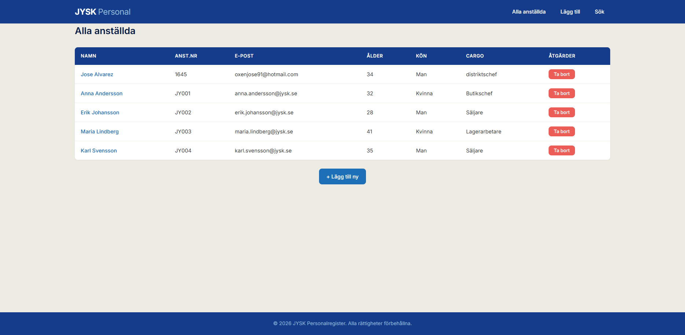
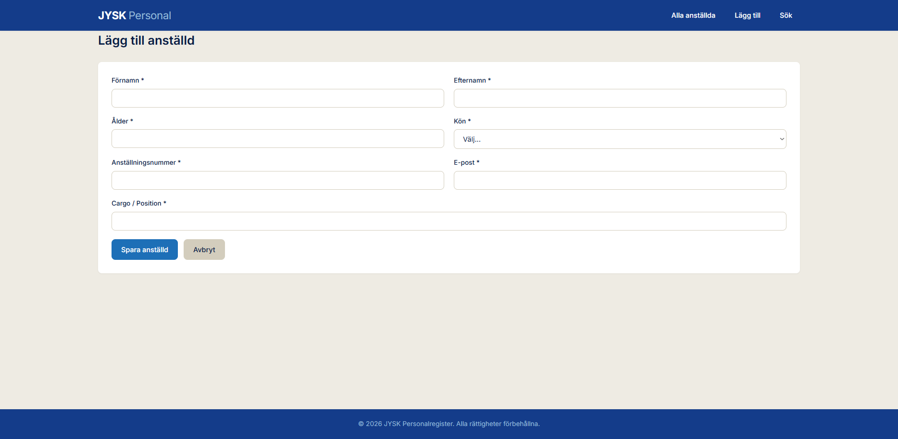
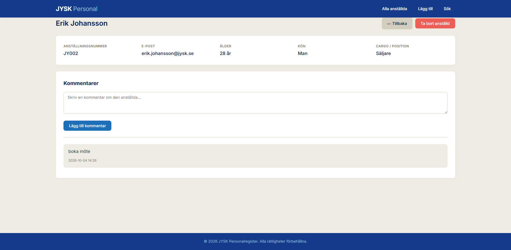
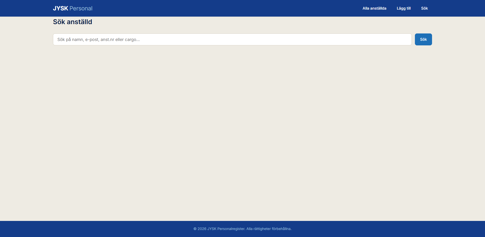

# JYSK Personalregister

Ett modernt webbaserat personalregister byggt med **Flask**, **SQLite** och **SQLAlchemy**. Applikationen är designad i JYSK:s skandinaviska stil med fokus på enkelhet, funktionalitet och en ren blå-vit palett.

---

## 📋 Om projektet

Personalregistret är ett internt verktyg för att hantera information om anställda i ett företag. Här kan du enkelt registrera nya medarbetare, söka bland befintliga, visa detaljerad information och lägga till kommentarer om varje person.

All text, knappar och meddelanden är på **svenska**, och gränssnittet är inspirerat av JYSK:s grafiska profil med blå och beige toner.

---

## ✨ Funktioner

- **Översikt över alla anställda** i en tydlig tabell
- **Lägg till nya anställda** med namn, ålder, kön, anställningsnummer, e-post och cargo
- **Visa detaljerad information** om varje anställd
- **Ta bort anställda** med bekräftelsedialog
- **Sökfunktion** som söker i namn, e-post, anställningsnummer och position
- **Kommentarer** – möjlighet att skriva och spara anteckningar om varje anställd
- **Responsiv design** som fungerar på både dator och mobil

---

## 🖼️ Skärmbilder

### Startsida – Alla anställda

*Översikt över samtliga anställda med sök- och åtgärdsknappar.*

### Lägg till anställd

*Formulär för att registrera en ny medarbetare.*

### Detaljvy med kommentarer

*Detaljerad information om en anställd samt möjlighet att lägga till kommentarer.*

### Sökfunktion

*Sökresultat som matchar namn, e-post eller cargo.*

---

## 🛠️ Teknik och verktyg

| Teknologi | Beskrivning |
|-----------|-------------|
| **Python 3** | Programmeringsspråk |
| **Flask** | Webbramverk |
| **SQLAlchemy** | ORM för databashantering |
| **SQLite** | Lättviktig databas |
| **Jinja2** | Mallmotor för HTML |
| **HTML5 & CSS3** | Struktur och styling |

---

## 🚀 Installation och start

### 1. Klona projektet
```bash
git clone https://github.com/oxenjose/person_register3
cd personregister

👤 Författare
Ditt Jose Alvarez

GitHub: @oxenjose

